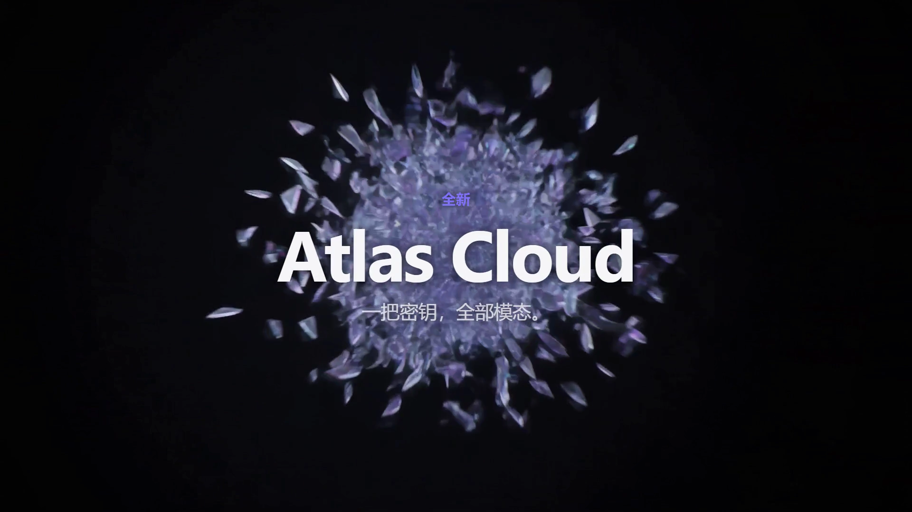
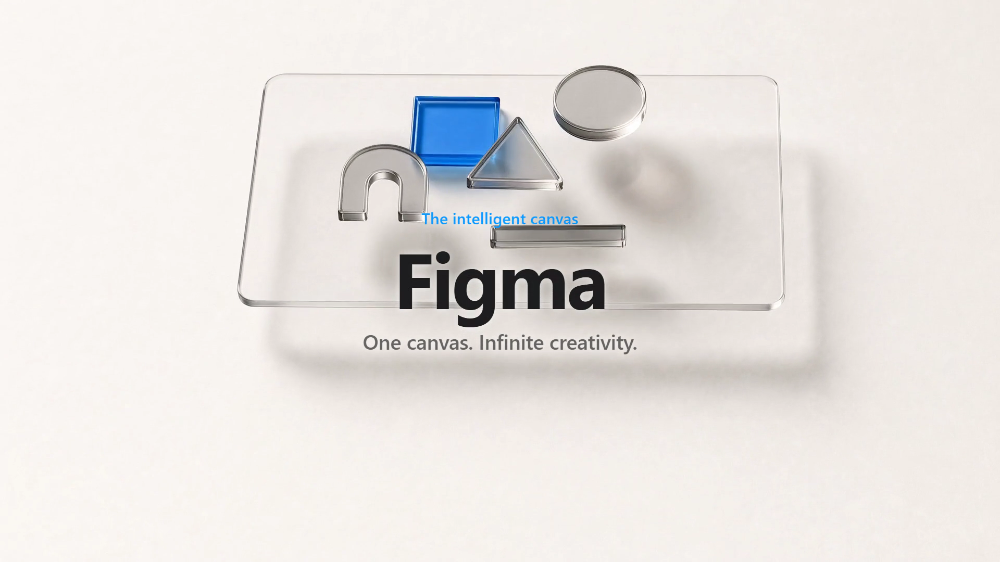
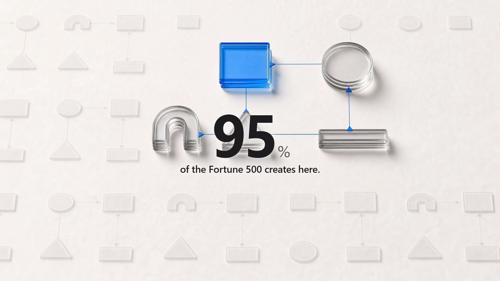

# product-pitch-video

A Claude Code / Claude Agent skill that turns a **product website URL into a finished ~30s MP4 pitch video** in Apple-launch style — AI-generated cinematic shots, AI soundtrack, pixel-perfect typography overlaid in post, auto-stitched with ffmpeg.

给一个产品网址,产出一条 WWDC 风格的 30 秒成片。

| Dark film (Atlas Cloud, liquid glass) | Light film (Figma, paper & acrylic) |
|---|---|
|  |  |
|  |  |

## How it works

```
product URL ─▶ ① understand + derive ─▶ ② pitch script ─▶ ③ pitch.json
                (belief / contribution)    (6 beats + keyframe chain)
   ─▶ ④ Phase A: keyframe stills ─▶ ⑤ HUMAN REVIEWS STORYBOARD ─▶ ⑥ Phase B: video + stitch ─▶ final.mp4
       (image model, ~$0.1-0.3)       (re-roll frames cheaply)        (parallel, ~$2.7)
```

The key ideas:

- **Storyboard-first.** N shots need N+1 keyframes where keyframe K_i is shot i's *last* frame AND shot i+1's *first* frame. Videos are generated with first+last frame conditioning, so adjacent shots cut seamlessly — no crossfade tricks. Taste decisions happen at image prices (~$0.01/frame) before the video budget is spent.
- **The model directs, the machine executes.** Claude reads the site (text facts + a rendered screenshot for visual temperament), derives a belief-and-contribution narrative (never a feature list), designs the keyframe chain, and writes `pitch.json`. The scripts do everything else — generation, polling, retries, overlays, ffmpeg — deterministically and resumably.
- **AI video can't render text**, so all words are typeset by a headless browser into transparent PNGs (Apple-grade type system, dark & light themes, positional variants) and composited in post. Fully editable without re-billing.
- **Resumable everywhere.** Delete one shot's mp4 → only that shot regenerates. Transient API failures (rate limits, 502s) retry automatically.

## Requirements

- [Claude Code](https://claude.com/claude-code) (the skill is the director — it needs a model to run it)
- Node 18+ (scripts are zero-dependency ESM)
- ffmpeg on PATH (or `FFMPEG_PATH`, or a static build in `tools/ffmpeg/`)
- Chrome or Edge (headless, for typography overlays and page screenshots)
- An [Atlas Cloud](https://www.atlascloud.ai) API key in `ATLAS_CLOUD_API_KEY` (env var or `.env` in your working directory) — video (Seedance 2.0), images (Seedream / gpt-image-2), music (MiniMax / Suno) all through one key

## Install

```bash
git clone https://github.com/huangjie127/pitch-video-auto-generation.git ~/.claude/skills/product-pitch-video
node ~/.claude/skills/product-pitch-video/scripts/doctor.mjs   # verify ffmpeg / browser / API key
```

Then in Claude Code: *"给这个产品做一条 pitch 视频: https://your-product.com"* or *"make a pitch video for https://your-product.com"*.

> All scripts are zero-dependency Node ESM — no `npm install`. The only
> external requirements are the four things `doctor.mjs` checks.

## Cost

A default 30s film (6 × 5s shots, 1080p): **≈ $2.9** — keyframes $0.07–0.22 + video $2.70 (Seedance 2.0 @ ~$0.09/s) + music $0.15. Iterate at half price with `seedance-2.0-mini` / 720p; re-roll a single keyframe for ~$0.01.

## Manual pipeline usage

```bash
node scripts/pipeline.mjs pitch.json --out build          # Phase A → storyboard.html, stops for review
node scripts/pipeline.mjs pitch.json --out build          # rerun after review → Phase B → final.mp4
node scripts/pipeline.mjs pitch.json --out build --dry    # cost estimate only
```

Individual stages: `gen_image.mjs`, `gen_video.mjs`, `gen_music.mjs`, `overlay.mjs`, `stitch.mjs`, `snap_page.mjs` — each is a standalone CLI. See `references/atlas-api.md` for the raw API.

## What's in the box

```
SKILL.md                     the director's brief (workflow, schema, quality bar)
references/
  pitch-script-guide.md      Apple's five moves, the URL→belief derivation protocol
  shot-prompt-language.md    keyframe/motion prompt language, restraint anchor, field-tested lessons
  atlas-api.md               verified API ground truth (endpoints, models, pricing)
scripts/                     zero-dep Node ESM: pipeline, generators, overlay, stitch
assets/overlay.html          the typography system (dark/light, CJK-ready)
```

Field-tested lessons baked into the references: never write a brand name into an image prompt (it draws the trademark), video models amplify subtle effects (constrain them), one accent color per film, reserve the lower third for typography, write copy in the product's language.

## License

MIT
